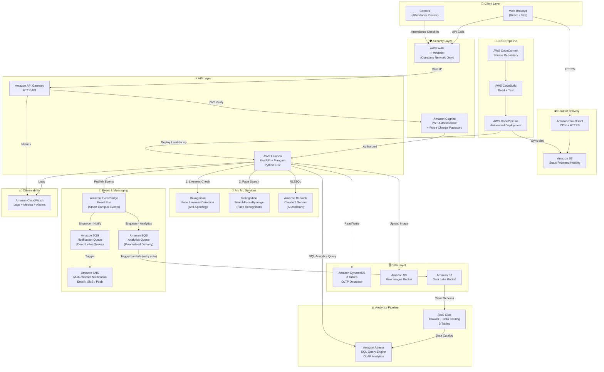
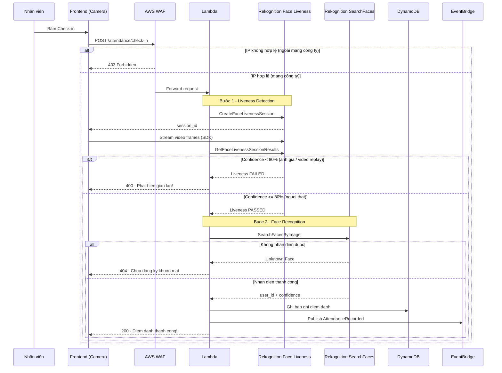
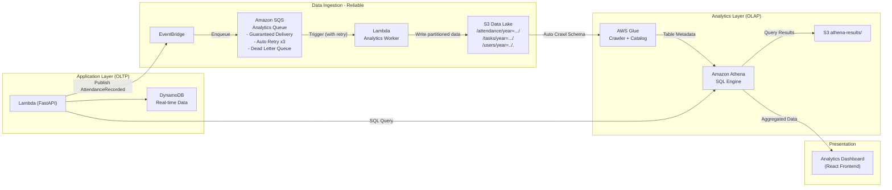

# Kiến trúc Hệ thống Smart Campus Platform

**Phiên bản:** 2.0  
**Nền tảng:** 100% Serverless trên AWS  
**Mô hình:** Event-Driven Microservices Architecture  

---

## 1. Tổng quan Kiến trúc

Smart Campus Platform được xây dựng theo mô hình **Serverless + Event-Driven** trên AWS, cho phép tự động mở rộng quy mô (auto-scale), không cần quản lý máy chủ vật lý và tối ưu chi phí vận hành.

### Triết lý Thiết kế

| Nguyên tắc | Mô tả |
|---|---|
| **Serverless First** | Ưu tiên dịch vụ managed, không quản lý OS/Server |
| **Event-Driven** | Các module giao tiếp qua EventBridge + SQS, giảm coupling |
| **Defense in Depth** | Bảo mật đa lớp: WAF → Cognito JWT → RBAC trong code |
| **Hybrid Analytics** | OLTP (DynamoDB) tách biệt OLAP (Athena + S3 Data Lake) |
| **AI-Powered Security** | Nhận diện khuôn mặt + Liveness Detection chống gian lận |
| **Reliable Messaging** | SQS đảm bảo không mất dữ liệu, retry tự động + Dead Letter Queue |

---

## 2. Sơ đồ Kiến trúc Tổng thể



---

## 3. Sơ đồ Luồng Bảo mật Điểm danh (Anti-Fraud)



---

## 4. So do Analytics Pipeline (Data Lake)



---

## 5. Danh sach Dich vu AWS Su dung

### 5.1 Core Services

| Dich vu | Vai tro | Workflow |
|---|---|---|
| **Amazon Cognito** | Xac thuc nguoi dung, phat hanh JWT, Force Change Password | WF1 |
| **AWS Lambda** | Chay FastAPI Backend (Python 3.12) qua Mangum | Tat ca |
| **Amazon API Gateway** | HTTP API endpoint, JWT Authorizer | Tat ca |
| **Amazon DynamoDB** | Database NoSQL chinh, 8 bang, da GSI | Tat ca |
| **Amazon S3** | Luu anh (Images Bucket) + Frontend tinh + Data Lake | WF2, WF5 |
| **Amazon CloudFront** | CDN phuc vu Frontend React, HTTPS tu dong | WF1 |

### 5.2 AI / ML Services

| Dich vu | Vai tro | Workflow |
|---|---|---|
| **Amazon Rekognition – IndexFaces** | Lap chi muc khuon mat khi dang ky | WF2 |
| **Amazon Rekognition – SearchFacesByImage** | Nhan dien khuon mat khi diem danh | WF3 |
| **Amazon Rekognition – Face Liveness** | Phat hien gian lan (anh gia / video replay) | WF3 |
| **Amazon Bedrock (Claude 3)** | AI Assistant – NL2SQL tieng Viet to Athena | WF6 |

### 5.3 Analytics Services

| Dich vu | Vai tro | Workflow |
|---|---|---|
| **AWS Glue Crawler** | Tu dong quet va hoc schema tu S3 Data Lake | WF5 |
| **AWS Glue Data Catalog** | Metadata catalog (smart_campus_db) – 3 tables | WF5 |
| **Amazon Athena** | SQL query engine – phan tich du lieu lon tren S3 | WF5, WF6 |

### 5.4 Event & Notification Services

| Dich vu | Vai tro | Workflow |
|---|---|---|
| **Amazon EventBridge** | Event Bus trung tam, dieu phoi toan bo su kien | WF3, WF4, WF5, WF8 |
| **Amazon SQS – Analytics Queue** | Hang doi bao dam ghi du lieu vao S3 Data Lake, retry tu dong, Dead Letter Queue | WF5 |
| **Amazon SQS – Notification Queue** | Hang doi bao dam gui thong bao, khong mat notification khi SNS loi | WF4 |
| **Amazon SNS** | Gui thong bao da kenh (Email, SMS, Push) | WF4 |
| **Amazon SES** | Gui email thong bao ca nhan | WF4 |

### 5.5 Security Services

| Dich vu | Vai tro |
|---|---|
| **AWS WAF** | Firewall lop mang – IP whitelist (chi mang cong ty) |
| **Amazon Cognito** | Xac thuc JWT, quan ly phien dang nhap |
| **IAM Roles** | Phan quyen toi thieu cho tung Lambda function |

### 5.6 DevOps / Observability

| Dich vu | Vai tro |
|---|---|
| **AWS CodeCommit** | Luu tru source code |
| **AWS CodeBuild** | Build Lambda zip + React dist, chay tests |
| **AWS CodePipeline** | Orchestrate tu dong deploy khi push code |
| **Amazon CloudWatch** | Thu thap logs, metrics, canh bao tu dong |

---

## 6. Cau truc Database (DynamoDB – 8 Bang)

| Bang | PK | GSI | Module |
|---|---|---|---|
| `smart-campus-users` | `user_id` | `email-index` | WF1, WF2 |
| `smart-campus-faces` | `face_id` | `user_id-index` | WF2, WF3 |
| `smart-campus-attendance` | `record_id` | `user_id-index`, `date-index` | WF3 |
| `smart-campus-notifications` | `notification_id` | `user_id-index` | WF4 |
| `smart-campus-security` | `incident_id` | `status-index` | WF7 |
| `smart-campus-tasks` | `task_id` | `assignee_id-status-index`, `status-createdAt-index` | WF8 |
| `smart-campus-leaves` | `request_id` | `user_id-index`, `status-index` | WF8 |
| `smart-campus-holidays` | `date` | — | WF8 |

---

## 7. Cau truc S3 Data Lake

```
smart-campus-datalake-{account}-ap-southeast-1/
├── attendance/
│   └── year=2026/month=08/day=04/
│       └── data.json          <- Glue Table: attendance
├── tasks/
│   └── year=2026/month=08/day=04/
│       └── data.json          <- Glue Table: tasks
├── users/
│   └── year=2026/month=08/day=04/
│       └── data.json          <- Glue Table: users
└── athena-results/            <- Ket qua truy van SQL
```

---

## 8. Tong hop 8 Workflows

| # | Workflow | Trigger | Dich vu chinh | Trang thai |
|---|---|---|---|---|
| **WF1** | User Authentication | HTTP Request | Cognito, API Gateway | Hoan thanh |
| **WF2** | Face Registration | HTTP Request | Rekognition IndexFaces, S3 | Hoan thanh |
| **WF3** | Attendance Check-in | HTTP Request | WAF, Rekognition Liveness, Rekognition Search | Hoan thanh |
| **WF4** | Notification | Event | EventBridge, SNS, SES | Hoan thanh |
| **WF5** | Analytics & Reporting | HTTP Request | Glue, Athena, S3 Data Lake | Hoan thanh |
| **WF6** | AI Assistant | HTTP Request | Bedrock Claude 3, Athena | Tam hoan (cho quota) |
| **WF7** | Security & Incident | Event | EventBridge, DynamoDB | Tam hoan (phu thuoc hardware) |
| **WF8** | Task & Leave Mgmt | HTTP Request + Event | DynamoDB, EventBridge, SNS | Hoan thanh |

---

## 9. Lo trinh Phat trien (Development Phases)

```
Phase 1 — Core Platform (Hoan thanh)
├── WF1: Authentication (Cognito)
├── WF2: Face Registration (Rekognition)
├── WF3: Attendance (SearchFacesByImage + Rule Engine)
├── WF4: Notifications (EventBridge + SNS)
├── WF5: Analytics (DynamoDB + Athena + Data Lake)
└── WF8: Task & Leave Management

Phase 2 — Security & Reliability Enhancement (Dang trien khai)
├── Rekognition Face Liveness (chong gian lan anh)
├── AWS WAF IP Restriction (chi mang cong ty)
├── Amazon SQS Analytics Queue (dam bao du lieu Data Lake)
├── Amazon SQS Notification Queue (dam bao gui thong bao)
├── CloudFront + S3 (Frontend CDN)
└── CloudWatch Logs & Alarms

Phase 3 — Enterprise Grade (Ke hoach)
├── CI/CD: CodeCommit + CodeBuild + CodePipeline
├── WF6: AI Assistant (Bedrock – cho quota)
├── Parameter Store (thay the .env)
└── AWS WAF Advanced Rules
```

---

*Tai lieu duoc cap nhat lan cuoi: 2026-08-04*  
*Tac gia: Smart Campus Development Team*
