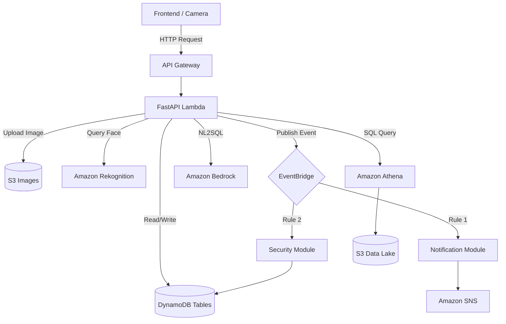

# Smart Campus Platform - System Overview & Architecture

Tài liệu này tổng hợp toàn bộ kiến trúc, các luồng nghiệp vụ (Workflows) hiện tại của hệ thống Smart Campus và đặc tả thiết kế cho Module Quản lý Task (chuẩn bị mở rộng).

---

## 1. Kiến trúc hệ thống (Serverless & Event-Driven)

Hệ thống được thiết kế theo mô hình **100% Serverless trên AWS**, giao tiếp với nhau bằng Event-Driven Architecture (Kiến trúc hướng sự kiện) nhằm đảm bảo khả năng mở rộng (scale) và tính độc lập (decoupling) giữa các module.

### Cấu trúc công nghệ cốt lõi:
- **Frontend:** React.js + Vite (Glassmorphism, Dark mode UI).
- **Backend API:** FastAPI (Python) bọc qua Mangum để chạy trên AWS Lambda.
- **API Gateway:** Nhận request từ Frontend và điều phối tới Lambda. Auth bằng Cognito JWT.
- **Database:** Amazon DynamoDB (NoSQL).
- **Storage:** Amazon S3 (Lưu ảnh Raw và Data Lake).
- **AI/ML:** 
  - **Amazon Rekognition:** Trích xuất đặc trưng và tìm kiếm khuôn mặt.
  - **Amazon Bedrock (Claude 3):** Xử lý ngôn ngữ tự nhiên (AI Assistant).
- **Analytics:** Amazon Athena query trực tiếp trên S3 Data Lake.
- **Message Broker:** Amazon EventBridge làm trái tim trung tâm trung chuyển Event.
- **Notification:** Amazon SNS.

### Sơ đồ luồng dữ liệu (Data Flow)

---

## 2. Tổng hợp 7 Workflows (Luồng nghiệp vụ) cốt lõi

Hệ thống hiện tại đang vận hành dựa trên 7 Workflow chính:

| Workflow                    | Module                | Mô tả nghiệp vụ                                                                                                             | Trigger / Event                                                                                          |
| :----------------------------| :----------------------| :----------------------------------------------------------------------------------------------------------------------------| :---------------------------------------------------------------------------------------------------------|
| **WF1 - Authentication**    | Cognito (API Gateway) | Quản lý đăng nhập, cấp phát JWT Token.                                                                                      | HTTP Request                                                                                             |
| **WF2 - Face Registration** | `faces`               | nhân viên tải ảnh lên. Hệ thống gọi Rekognition để `IndexFaces` và lưu metadata vào DynamoDB.                     | HTTP Request ➡️ Publish `FaceRegistered`                                                                  |
| **WF3 - Attendance**        | `attendance`          | Camera gửi ảnh tự động. Gọi Rekognition `SearchFacesByImage`. Chạy Rule Engine kiểm tra ca học, trùng lặp.                  | HTTP Request ➡️ Publish `AttendanceRecorded`, `UnknownFaceDetected`, `AttendanceRejected`                 |
| **WF4 - Notification**      | `notifications`       | Lắng nghe Event, format tin nhắn theo template và bắn gửi qua SNS (Email, SMS, App Push).                                   | Lắng nghe `AttendanceRecorded`, `AttendanceRejected`                                                     |
| **WF5 - Analytics**         | `reports` + Athena    | Sinh báo cáo tổng quan. Phase 1 dùng DynamoDB. Phase 2 query SQL siêu tốc qua Athena.                                       | HTTP Request                                                                                             |
| **WF6 - AI Assistant**      | `ai_assistant`        | Admin hỏi dữ liệu bằng tiếng Việt. Bedrock chuyển ngữ thành SQL ➡️ Chạy trên Athena ➡️ Bedrock dịch SQL result ra tiếng Việt. | HTTP Request                                                                                             |
| **WF7 - Security**          | `security`            | Đánh giá mức độ rủi ro (Risk Level) của các sự kiện dị thường. Tạo Incident và cảnh báo.                                    | Lắng nghe `UnknownFaceDetected`, `AttendanceRecorded` (out of hours) ➡️ Publish `SecurityIncidentCreated` |

---

## 3. Cấu trúc Database hiện tại (DynamoDB)

Dưới đây là cấu trúc Schema hiện tại cho 5 bảng DynamoDB cốt lõi đang vận hành trong hệ thống:

### `smart-campus-users` (WF1, WF2)
- `user_id` (PK) - UUID
- `email` (String) - Global Secondary Index (GSI)
- `full_name` (String)
- `role` (String) - `STUDENT`, `STAFF`, `ADMIN`
- `is_active` (Boolean)
- `created_at` (String)

### `smart-campus-faces` (WF2, WF3)
- `face_id` (PK) - Sinh ra từ Amazon Rekognition
- `user_id` (String) - Link tới bảng Users (GSI)
- `image_key` (String) - Đường dẫn ảnh trên S3
- `created_at` (String)

### `smart-campus-attendance` (WF3)
- `record_id` (PK) - UUID
- `user_id` (String) - (GSI 1)
- `date` (String) - (GSI 2, format: YYYY-MM-DD)
- `timestamp` (String) - ISO 8601
- `status` (String) - `PRESENT`, `LATE`, `ABSENT`
- `camera_id` (String)
- `confidence` (Float) - Tỷ lệ chính xác của Rekognition

### `smart-campus-security` (WF7)
- `incident_id` (PK) - UUID
- `timestamp` (String)
- `risk_level` (String) - `LOW`, `MEDIUM`, `HIGH`, `CRITICAL`
- `type` (String) - `UNKNOWN_FACE`, `UNAUTHORIZED_ACCESS`
- `status` (String) - `OPEN`, `INVESTIGATING`, `RESOLVED`
- `details` (Map) - Chi tiết sự kiện

### `smart-campus-notifications` (WF4)
- `notification_id` (PK) - UUID
- `user_id` (String) - Người nhận (GSI)
- `type` (String) - `SMS`, `EMAIL`, `APP`
- `message` (String)
- `status` (String) - `PENDING`, `SENT`, `FAILED`
- `created_at` (String)

---

## 4. Mở rộng Hệ thống: Thiết kế Module Quản lý Task (Workflow 8)

Đây là bản đặc tả nghiệp vụ cho **Task Management**, giúp Smart Campus chuyển từ "Giám sát" sang "Vận hành tự động".

### 4.1. Phân loại Task (Task Types)
1. **SECURITY_CHECK:** Task khẩn cấp sinh ra từ WF7 (ví dụ: yêu cầu bảo vệ đến cổng A kiểm tra người lạ).
2. **MAINTENANCE:** Task bảo trì thiết bị (camera hỏng, máy lạnh hư).
3. **GENERAL:** Task công việc chung giao cho nhân sự.

### 4.2. Luồng hoạt động (Event-Driven Flow)
1. **Tạo Task tự động:** Module `tasks` lắng nghe event `SecurityIncidentCreated` (mức độ HIGH/CRITICAL) từ EventBridge ➡️ Tự động tạo một Task `SECURITY_CHECK` và assign cho bảo vệ đang trực.
2. **Tạo Task thủ công:** Admin tạo Task trên Frontend giao cho nhân viên (API `POST /tasks`).
3. **Thông báo (Notification):** Sau khi lưu Task vào DynamoDB, publish event `TaskAssigned`. Module WF4 (Notification) sẽ nhận event này và nhắn tin cho người được giao việc.
4. **Cập nhật trạng thái:** Nhân viên mở app, chuyển trạng thái Task (`TODO` ➡️ `IN_PROGRESS` ➡️ `DONE`). Khi done, publish `TaskCompleted`.
5. **Đóng sự cố (Auto Resolve):** Module Security (WF7) lắng nghe `TaskCompleted`. Nếu task này link với một Security Incident, hệ thống tự động Resolve Incident đó.

### 4.3. Thiết kế Database Schema (DynamoDB)

**Table:** `smart-campus-tasks`

| Attribute | Type | Chú thích |
|:---|:---|:---|
| `taskId` (PK) | String | UUID của task |
| `assigneeId` | String | ID của nhân viên nhận task (dùng cho GSI để filter) |
| `taskType` | String | `SECURITY_CHECK`, `MAINTENANCE`, `GENERAL` |
| `status` | String | `TODO`, `IN_PROGRESS`, `DONE`, `CANCELLED` |
| `priority` | String | `LOW`, `MEDIUM`, `HIGH`, `URGENT` |
| `title` | String | Tiêu đề công việc |
| `description` | String | Chi tiết công việc |
| `linkedIncidentId`| String | (Optional) Link tới Security Incident nếu có |
| `createdAt` | String | ISO 8601 Timestamp |
| `dueDate` | String | (Optional) Hạn chót |

**GSI (Global Secondary Index):**
- `assigneeId-status-index`: Giúp query nhanh "Lấy tất cả các task `TODO` của bảo vệ Nguyễn Văn A".

### 4.4. Cấu trúc API Endpoints dự kiến

Thư mục: `app/modules/tasks/`

| Phương thức | Endpoint | Chức năng |
|:---|:---|:---|
| `POST` | `/tasks` | Admin tạo Task mới thủ công. |
| `GET` | `/tasks` | Lấy danh sách task (có filter theo `assigneeId`, `status`). |
| `GET` | `/tasks/{taskId}` | Xem chi tiết 1 task. |
| `PATCH`| `/tasks/{taskId}/status` | Nhân viên update trạng thái task (In Progress / Done). |

### 4.5. Sự kiện EventBridge (Mới)

| Tên Event | Nguồn phát | Mục đích |
|:---|:---|:---|
| `TaskAssigned` | WF8 (Tasks) | Kích hoạt WF4 gửi thông báo cho nhân viên. |
| `TaskCompleted` | WF8 (Tasks) | Kích hoạt WF7 đóng Security Incident (nếu có linked). |

---
**Kết luận:** Module Task Management khớp hoàn hảo vào kiến trúc hiện tại mà không cần sửa đổi các core logic cũ, chứng minh sức mạnh của kiến trúc Event-Driven Microservices trên AWS.
