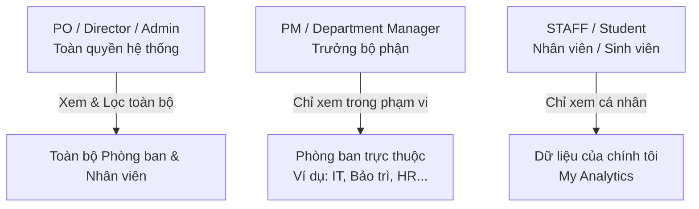

# TÀI LIỆU NGHIỆP VỤ: HỆ THỐNG BÁO CÁO & PHÂN TÍCH CHUYÊN SAU (ENTERPRISE ANALYTICS & REPORTING - WF5 UPGRADE)

**Dự án:** Smart Campus Platform  
**Phân hệ:** Workflow 5 (Analytics Pipeline & Business Reporting)  
**Ngày cập nhật:** 2026-07-25  
**Trạng thái:** Thiết kế nghiệp vụ chi tiết (Detailed Business Logic)

---

## 1. TỔNG QUAN PHÂN HỆ (OVERVIEW)

### 1.1. Bối cảnh & Mục tiêu
Ban đầu, module Báo cáo (Workflow 5) được thiết kế cho quy mô nhỏ nhằm thống kê tỉ lệ chuyên cần (Attendance Rate) cơ bản của sinh viên. Khi hệ thống mở rộng quy mô lên mức **Doanh nghiệp/Tổ chức lớn (Enterprise Platform)** với sự tích hợp của Quản lý Công việc & Sự cố Bảo trì (Workflow 8), phân hệ Báo cáo cần được nâng cấp toàn diện thành một **Trung tâm Điều hành (Command Center)**.

Mục tiêu của sự nâng cấp này bao gồm:
1. **Phân cấp góc nhìn theo Phòng ban (Department-Level Analytics):** Cung cấp công cụ quản trị sâu cho từng Trưởng bộ phận thay vì chỉ hiển thị số liệu toàn cục.
2. **Kết nối chéo dữ liệu (Cross-Module Insights):** Liên kết số liệu Điểm danh khuôn mặt (WF3) với Hiệu suất xử lý công việc/Task (WF8) để đánh giá năng lực thực tế của nhân sự.
3. **Phân quyền bảo mật chặt chẽ (Role-Based Access Control - RBAC):** Định nghĩa rõ ràng quyền hạn và phạm vi truy cập dữ liệu giữa Lãnh đạo cấp cao (PO/Director), Trưởng bộ phận (PM/Manager) và Nhân viên (Staff).

---

## 2. PHÂN TẦNG QUYỀN HẠN & MA TRẬN TRUY CẬP (RBAC MATRIX)

Để đảm bảo tính bảo mật dữ liệu nhân sự và tuân thủ trách nhiệm quản lý, hệ thống chia làm 3 tầng phân quyền nghiệp vụ:



### 2.1. PO (Product Owner / Director / Admin - Lãnh đạo cấp cao)
* **Vai trò:** Người quản trị hệ thống, Ban Giám đốc hoặc Lãnh đạo tổng thể dự án.
* **Phạm vi truy cập (View Scope):** **Toàn cục (Global View)** - Có quyền truy cập vào toàn bộ dữ liệu của tất cả phòng ban, chi nhánh và cá nhân.
* **Quyền hạn nghiệp vụ:**
  * Được xem Dashboard tổng thể của cả nhà trường/công ty.
  * Sử dụng bộ lọc chọn phòng ban để xem báo cáo sâu của bất kỳ phòng ban nào (IT, HR, An ninh, Bảo trì...).
  * Xem **Bảng phong thần & So sánh chéo (Department Comparison Matrix)** giữa các bộ phận để đánh giá đơn vị nào tuân thủ tốt nhất.
  * Truy cập vào chi tiết nhật ký điểm danh và tiến độ công việc của từng cá nhân trong toàn tổ chức.
  * **Xuất báo cáo (Export):** Được xuất dữ liệu tổng hợp hoặc chi tiết của toàn bộ hệ thống ra file Excel/PDF.

### 2.2. PM (Project Manager / Department Manager - Trưởng phòng / Quản lý)
* **Vai trò:** Trưởng phòng, Quản lý bộ phận (Ví dụ: Trưởng phòng IT, Tổ trưởng Tổ Bảo trì, Đội trưởng An ninh).
* **Phạm vi truy cập (View Scope):** **Phạm vi Phòng ban (Department-Scoped View)** - Dữ liệu tự động được lọc theo trường `department` của tài khoản quản lý đó.
* **Quyền hạn nghiệp vụ:**
  * Khi vào trang Analytics, hệ thống tự động nhận diện bộ phận (Ví dụ: `MAINTENANCE`) và chỉ hiển thị số liệu của bộ phận đó.
  * **Khóa bộ lọc:** Dropdown chọn bộ phận bị vô hiệu hóa đối với các phòng ban khác (PM không thể tò mò hoặc xem số liệu của phòng ban không thuộc quyền quản lý của mình).
  * Xem tỉ lệ chuyên cần chung, biểu đồ xu hướng đúng giờ/muộn của riêng bộ phận mình.
  * Xem danh sách **Top nhân viên vắng/muộn trong phòng** để kịp thời đôn đốc, nhắc nhở.
  * **Quản trị tải công việc (Workload Analytics):** Xem thống kê số lượng sự cố/task được giao, tỉ lệ hoàn thành công việc của từng thành viên trong phòng.
  * **Xuất báo cáo (Export):** Chỉ được phép xuất dữ liệu thống kê của phòng ban mình phụ trách.

### 2.3. STAFF (Nhân viên / Sinh viên / Kỹ thuật viên)
* **Vai trò:** Nhân viên thực thi công việc, không có quyền quản lý người khác.
* **Phạm vi truy cập (View Scope):** **Cá nhân (Self-Service / Personal View)**.
* **Quyền hạn nghiệp vụ:**
  * Không có quyền xem Dashboard tổng của công ty hay của phòng ban (tránh so sánh nhạy cảm giữa các cá nhân và bảo mật thông tin nội bộ).
  * Giao diện tự động chuyển sang chế độ **"My Analytics" (Báo cáo cá nhân)**:
    * **Chuyên cần cá nhân:** Tỉ lệ đi làm đúng giờ, đi muộn, vắng mặt của bản thân trong tuần/tháng.
    * **Nhật ký ra vào:** Bảng chi tiết timestamp check-in/check-out hằng ngày để tự đối chiếu công/lương.
    * **Hiệu suất cá nhân:** Thống kê số task đang thực hiện, số task đã hoàn thành, và các cảnh báo deadline sắp tới.
  * **Xuất báo cáo:** Không được phép xuất báo cáo tổng hợp, chỉ được tải về bảng chấm công cá nhân của mình.

### 2.4. Ma trận Phân quyền Báo cáo (RBAC Permission Table)

| Tính năng / Nghiệp vụ | PO / Director / Admin | PM / Department Manager | STAFF / Employee |
| :--- | :---: | :---: | :---: |
| **Xem Dashboard tổng toàn tổ chức** | ✅ Có | ❌ Không | ❌ Không |
| **So sánh hiệu suất giữa các Phòng ban** | ✅ Có | ❌ Không | ❌ Không |
| **Lọc & xem số liệu của phòng ban khác** | ✅ Có | ❌ Không | ❌ Không |
| **Xem thống kê tổng hợp của phòng mình** | ✅ Có | ✅ Có | ❌ Không |
| **Xem Top nhân viên đi muộn trong phòng** | ✅ Có | ✅ Có | ❌ Không |
| **Phân tích tải công việc (Task Workload) trong phòng** | ✅ Có | ✅ Có | ❌ Không |
| **Xem báo cáo cá nhân (My Analytics)** | ✅ Có | ✅ Có | ✅ Có |
| **Xuất dữ liệu Excel / PDF (Export)** | ✅ Toàn hệ thống | ✅ Chỉ phòng mình | ❌ Không |

---

## 3. NGHIỆP VỤ BÁO CÁO THEO PHÒNG BAN (DEPARTMENT-LEVEL ANALYTICS)

Để giải quyết bài toán quản lý ở quy mô lớn, hệ thống triển khai 2 cơ chế phân tích song song: **Global Filter (Lọc theo phòng ban)** và **Comparison Matrix (So sánh chéo phòng ban)**.

### 3.1. Các Chỉ số Quản trị Trọng yếu (Department KPIs)

Hệ thống tính toán các chỉ số KPI theo thời gian thực cho từng bộ phận dựa trên các công thức sau:

1. **Tỉ lệ Tuân thủ Giờ giấc (Punctuality Rate):**
   $$\text{Punctuality Rate} = \frac{\sum \text{PRESENT}}{\sum \text{PRESENT} + \sum \text{LATE} + \sum \text{ABSENT}} \times 100$$
   * *Ý nghĩa:* Đánh giá mức độ chấp hành nội quy đúng giờ của tập thể phòng ban.

2. **Chỉ số Đi muộn (Tardiness Index):**
   $$\text{Tardiness Index} = \frac{\sum \text{LATE}}{\text{Tổng lượt điểm danh}} \times 100$$
   * *Nghiệp vụ:* Nếu bộ phận có Tardiness Index > **15%**, hệ thống hiển thị cảnh báo màu vàng trên Dashboard của Giám đốc.

3. **Tỉ lệ Vắng mặt (Absenteeism Rate):**
   $$\text{Absenteeism Rate} = \frac{\sum \text{ABSENT}}{\text{Tổng lượt điểm danh}} \times 100$$

### 3.2. Bảng Phong thần & So sánh Phòng ban (Department Comparison Matrix)
Trên Dashboard của PO/Director, xuất hiện widget **"Hiệu suất theo Phòng ban"** trình bày dưới dạng biểu đồ Bar Chart và Bảng tổng hợp:

| Bộ phận | Tổng nhân sự | Tỉ lệ Đúng giờ (%) | Số lượt Đi muộn | Số lượt Vắng | Trạng thái đánh giá |
| :--- | :---: | :---: | :---: | :---: | :---: |
| **IT Department** | 25 | 96.5% | 4 | 1 | 🟢 Xuất sắc |
| **An ninh (Security)** | 18 | 92.0% | 8 | 2 | 🟢 Tốt |
| **Bảo trì (Maintenance)** | 15 | 86.6% | 14 | 4 | 🟡 Cần cải thiện |
| **Hành chính (Admin)** | 10 | 98.0% | 1 | 0 | 🟢 Xuất sắc |

---

## 4. TÍCH HỢP BÁO CÁO CÔNG VIỆC & SỰ CỐ (WF8 WORKLOAD ANALYTICS)

Đây là bước đột phá nghiệp vụ giúp kết nối dữ liệu từ camera nhận diện khuôn mặt (WF3) với tiến độ xử lý công việc thực tế (WF8). Riêng đối với các bộ phận kỹ thuật như **Bảo trì (Maintenance)** và **An ninh (Security)**, báo cáo được bổ sung các chỉ số chuyên sâu về công việc.

### 4.1. Chỉ số Hiệu suất Công việc (Task Performance KPIs)
Khi PM bộ phận Bảo trì hoặc PO xem báo cáo của phòng Bảo trì, hệ thống hiển thị thêm các chỉ số:
* **Total Assigned Tasks:** Tổng số sự cố/công việc được phân công trong kỳ.
* **Task Completion Rate:** Tỉ lệ hoàn thành công việc đúng hạn:
  $$\text{Completion Rate} = \frac{\text{Số Task DONE}}{\text{Tổng số Task được giao}} \times 100$$
* **Thời gian Xử lý Trung bình (MTTR - Mean Time To Repair):** Thời gian trung bình từ lúc sự cố được báo cáo (OPEN) đến lúc kỹ thuật viên hoàn thành (DONE).

### 4.2. Phân tích Phân bổ Nguồn lực (Workload Distribution Analysis)
Biểu đồ scatter plot hoặc bảng phân tích chéo giữa **Tỉ lệ chuyên cần** và **Khối lượng công việc** của từng nhân viên:

| Kỹ thuật viên | Tỉ lệ Đúng giờ | Số Task đang giữ (In Progress) | Số Task đã xong (Done) | Đánh giá Tải công việc |
| :--- | :---: | :---: | :---: | :---: |
| **Nguyễn Văn A** | 98.0% | 12 | 45 | 🔴 **Quá tải (Overloaded)** |
| **Tran Van B** | 85.0% | 2 | 10 | 🟡 **Dưới tải (Underutilized)** |
| **Le Van C** | 94.0% | 5 | 28 | 🟢 **Cân bằng (Balanced)** |

👉 **Giá trị nghiệp vụ:** Giúp PM phát hiện ngay tình trạng mất cân bằng công việc (Nhân viên A làm không hết việc trong khi Nhân viên B đang quá rảnh), từ đó sử dụng tính năng **Phân công lại (Re-assign)** trong WF8 để điều phối nguồn lực.

---

## 5. CẢNH BÁO BẤT THƯỜNG & TỰ ĐỘNG HÓA BÁO CÁO (ANOMALY DETECTION & AUTOMATION)

### 5.1. Nhận diện & Cảnh báo Bất thường (Automated Anomaly Alerts)
Hệ thống chạy background workers để tự động phát hiện các mẫu hành vi bất thường và đẩy notification (WF4):
1. **Cảnh báo đi muộn liên tiếp:** Nếu một nhân viên đi muộn **3 ngày liên tiếp**, hệ thống tự động tạo cảnh báo gửi đến PM quản lý trực tiếp.
2. **Cảnh báo sụt giảm hiệu suất:** Nếu tỉ lệ hoàn thành công việc của bộ phận Bảo trì giảm xuống dưới **70%** trong tuần, cảnh báo được gửi đến PO/Director.
3. **Cảnh báo khuôn mặt lạ (Security Anomaly):** Sự gia tăng đột biến (> 10 lần/ngày) của sự kiện `Unknown Face` tại một camera khu vực hạn chế.

### 5.2. Báo cáo Định kỳ Tự động (Automated Email Digests)
* **Weekly Department Digest (Gửi cho PM):** 08:00 sáng Thứ Hai hằng tuần, hệ thống tự động gửi email cho Trưởng các bộ phận tóm tắt số liệu tuần trước của phòng mình: Tỉ lệ chuyên cần, Top 3 nhân viên đi muộn, Danh sách sự cố còn tồn đọng.
* **Monthly Executive Summary (Gửi cho PO/Director):** Ngày 01 hằng tháng, gửi báo cáo tổng kết toàn công ty cho Ban Giám đốc kèm link tải file báo cáo chi tiết từ Amazon Athena.

---

## 6. KIẾN TRÚC KỸ THUẬT & API ENDPOINTS (TECHNICAL ARCHITECTURE)

### 6.1. Kiến trúc Query 2 Động cơ (Dual-Engine Query Pipeline)
Module Reports sử dụng kiến trúc lai để tối ưu chi phí và hiệu năng:
* **Phase 1 (DynamoDB Direct Query - Real-time):** Dùng cho truy vấn dữ liệu nóng trong ngày hoặc khoảng thời gian ngắn (< 14 ngày). Xử lý nhanh, độ trễ thấp, phục vụ Dashboard hằng ngày.
* **Phase 2 (Amazon Athena + S3 Data Lake - Big Data):** Khi truy vấn báo cáo lịch sử dài hạn (tháng/quý/năm) hoặc tổng hợp lượng lớn dữ liệu trên toàn doanh nghiệp, hệ thống chuyển hướng truy vấn sang Athena để không làm nghẽn DynamoDB.

### 6.2. Thiết kế API Endpoints nâng cấp

#### 1. `GET /api/reports/summary`
* **Tham số bổ sung:** `?period_start=YYYY-MM-DD&period_end=YYYY-MM-DD&department=IT`
* **Quyền truy cập:** PO (chọn bất kỳ department nào hoặc tất cả), PM (bị ép buộc tham số `department` bằng phòng ban của mình), STAFF (bị từ chối `403 Forbidden`).

#### 2. `GET /api/reports/departments` (New Endpoint)
* **Mô tả:** Trả về bảng thống kê so sánh hiệu suất giữa tất cả các phòng ban trong công ty.
* **Quyền truy cập:** Chỉ dành cho **PO / Director / Admin**.
* **Response:**
  ```json
  {
    "success": true,
    "data": {
      "period_start": "2026-07-01",
      "period_end": "2026-07-25",
      "departments": [
        {
          "department": "IT",
          "total_users": 25,
          "punctuality_rate": 96.5,
          "tardiness_index": 3.5,
          "status_evaluation": "EXCELLENT"
        },
        {
          "department": "MAINTENANCE",
          "total_users": 15,
          "punctuality_rate": 86.6,
          "tardiness_index": 13.4,
          "total_assigned_tasks": 52,
          "task_completion_rate": 88.5,
          "status_evaluation": "NEEDS_IMPROVEMENT"
        }
      ]
    }
  }
  ```

#### 3. `GET /api/reports/my-analytics` (New Endpoint for STAFF)
* **Mô tả:** Trả về số liệu chấm công và hiệu suất task của chính user đang đăng nhập.
* **Quyền truy cập:** Tất cả user đăng nhập (Đặc biệt dành cho STAFF).

---

## 7. KẾ HOẠCH TRIỂN KHAI (NEXT STEPS)

1. **Cập nhật Backend (`reports/service.py`):**
   * Thêm bộ lọc `department` vào các hàm `get_report_summary` và `get_attendance_trend`.
   * Viết hàm mới `get_department_comparison_stats` cho PO.
2. **Cập nhật Frontend (`Analytics.jsx`):**
   * Tích hợp Role-check: Đọc `user.role` và `user.department` từ context/token.
   * Thêm Dropdown chọn Bộ phận (Khóa lại nếu là PM).
   * Vẽ biểu đồ **Department Comparison Bar Chart** cho PO.
   * Xây dựng view riêng **My Analytics** cho STAFF.
